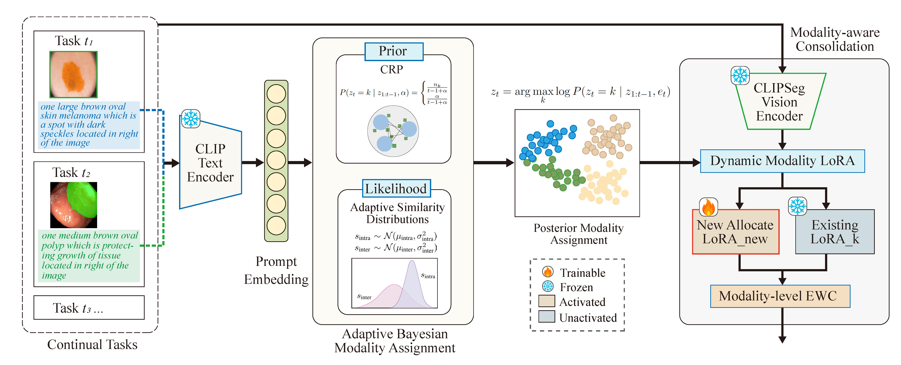

# MedCRP-CL

**Continual Medical Image Segmentation via Bayesian Nonparametric Semantic Modality Discovery**

[Paper (ICML 2026)](https://openreview.net/forum?id=v0DWbfP3b9) · [Checkpoint (HuggingFace)](https://huggingface.co/clg-g/MedCRP-CL)

## Abstract

Medical image segmentation faces a fundamental challenge in continual learning: data arrives sequentially from heterogeneous sources, yet effective continual learning requires discovering which tasks share sufficient structure to benefit from joint learning. Existing methods either apply uniform constraints across all tasks, causing catastrophic forgetting when tasks conflict, or require predefined task groupings that cannot anticipate future task diversity. We introduce MedCRP-CL, a framework that performs online task structure discovery and structure-aware continual learning. Leveraging the Chinese Restaurant Process (CRP), our method dynamically infers task groupings from clinical text prompts as tasks arrive, without requiring predefined cluster counts or access to future tasks. We term these discovered groupings *semantic modalities*, as they capture finer-grained structure than physical imaging modalities by integrating anatomical region and pathological context. Guided by this discovered structure, we maintain semantic modality-specific LoRA adapters regularized by intra-modality EWC, ensuring parameter isolation across dissimilar task groups while facilitating knowledge transfer within similar ones. The framework is also replay-free, storing only aggregate statistics rather than raw patient data. Experiments on 16 medical segmentation tasks across four imaging modalities demonstrate that MedCRP-CL achieves 73.3% Dice score with only 4.1% forgetting, outperforming the best baseline by 8.0% while requiring 6× fewer parameters.

<p align="center">
  <br>
  <em>Figure 1: Overview of MedCRP-CL.</em>
</p>

## Project Structure

```
MedCRP-CL/
├── scripts/
│   ├── model.py               # Model: Adaptive CRP, Dynamic LoRA, EWC
│   ├── train.py               # Training loop, evaluation, checkpoint I/O
│   ├── main.py                # Entry point for training
│   ├── inference.py           # Entry point for inference
│   ├── metrics.py             # Dice score computation
│   ├── prompt_strategies.py   # Text prompt selection
│   └── task_orders.py         # Task sequence definitions
├── data/                      # Datasets (see DATASETS.MD)
├── DATASETS.MD
├── requirements.txt
└── README.md
```

## Installation

Create a Python 3.10 environment:

```sh
# Conda
conda create --name medcrp python=3.10
conda activate medcrp

# OR venv
python -m venv medcrp
source medcrp/bin/activate
```

Install dependencies:

```sh
pip install -r requirements.txt
```

## Dataset Preparation

Please refer to [DATASETS.MD](DATASETS.MD) for download links and directory layout.

## Training

```sh
python scripts/main.py
```

## Inference

Download the pretrained checkpoint from [HuggingFace](https://huggingface.co/clg-g/MedCRP-CL):

```sh
pip install huggingface_hub
huggingface-cli download clg-g/MedCRP-CL --local-dir checkpoints/MedCRP-CL
```

Run evaluation:

```sh
python scripts/inference.py checkpoints/MedCRP-CL
```

## Acknowledgement

This codebase builds upon [MedVLSM](https://github.com/naamiinepal/medvlsm) (Exploring Transfer Learning in Medical Image Segmentation using Vision-Language Models, MIDL 2024). We thank the original authors for their open-source contribution.
